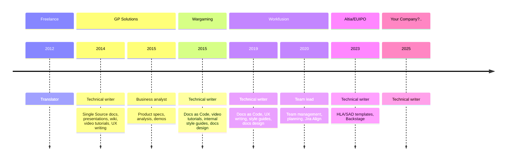

## [Altia](https://www.altia.es/)

### Senior technical writer

:::info November 2023—present
:::

Project for [European Union Intellectual Property Office (EUIPO)](https://www.euipo.europa.eu/en).

Besides usual documentation activities, I've:

- Created and updated templates of HLA and SAD documents for architects and developers.
- Integrated the Backstage tool into the workflow.
- Supported transfer from Confluence and Word documents to the Docs as Code approach.

## [WorkFusion](https://www.workfusion.com/)

### Senior technical writer

:::info April 2019—September 2023
:::

- **Created and managed documentation** for customers, developers, and DevOps.

    The work was mainly about creating instructions for internal and external Site Reliability and DevOps engineers to help them install the Product on-premise and in AWS/GCP, configure it, and maintain the correct operation. This decreased the number of requests to the Support team by 20-30%.

    Also, I documented new software solutions from scratch and decided on the best way and structure to represent the new materials.

- Successfully embedded the "**Docs as Code**" approach in the development workflow. Implemented Static Site Generators, Git, Markdown, and CI/CD (Jenkins) for writing and publishing documentation.

    When I came to the Company, all the documentation was maintained in Confluence. Due to the Platform's technical limitations, it was decided to deploy our Documentation Portal using a static site generator. After some discussion, the team and I chose Docusaurus due to its versioning and searching capabilities—all we missed in Confluence. In the course of migrating, I learned the new tool, got a better knowledge of Git and Bitbucket, figured out how to use the Algolia search and integrate various React plugins, and also created my first job in Jenkins.

    The whole effort allowed the Company to save $15,000-20,000/year on the infrastructure alone. Also, constant learning and using tools like ChatGPT made it possible to abandon the service of Confluence admins and Front-end engineers and close the technical tasks related to the generator by myself.

- Pioneered the **UX Writing** process within the company. Created and reviewed microcopy. Developed UI style guide.

    I offered our services to the UX Design team to help them improve the microcopy in the Product interface. Previously, the interface texts were created by engineers or Project Managers, so the first naming ideas often went directly to production. As the Documentation team worked with the texts, I wanted quality materials in articles and beyond. My team needed to gain experience in this field. Thus, we independently studied UX Writing and shared all cases we could find online. Within the shortest possible time, I created the new workflow that included Designers and Product Owners, initiated the creation of the Style Guide for the Product microcopy, and hosted and participated in weekly writing review sessions.

    As a result, the solutions that featured the novelty approach received a positive reception from clients. The feedback stated that the new intuitive design and accompanying articles were enough for work, and there was no need to address Support for help.

- Successfully worked with **Development, Product, and Delivery** teams.

    As a part of a standard writing routine, I interviewed engineers and feature owners to collect the required information and decide on its location within the documentation structure.

    The Company released a new version of the Product four times a year. I worked closely with Product Owners, Directors, and engineers on the extensive release notes for each version. The stakeholders provided the information and feedback and contributed in writing.

- **Assisted developers** with the documentation-related workflow and set up the contribution processes.

    As the Docs as Code approach became a documentation standard within the Company, some engineers preferred to write or update articles by themselves and send the result for review. I instructed them about the peculiarities of the static site generator, use cases, tips, and possible issues. Also, I created a template structure for the support articles that could be quickly applied and published.

### Team lead

:::info June 2020—September 2023
:::

- Managed and prioritized **Documentation backlog**.
    
    I participated in monthly Company-wide sessions, presenting the team's plans for the next two sprints. While preparing for planning, I assessed the scope and risks, decided on the priority of tasks, created new Stories, Epics, and Master Features in Jira, and decomposed them.

- **Supervised** a team of three technical writers.

    Three (with periodic growth of up to four) writers were on the team, including myself. As they were strong senior-level professionals, none required micromanagement or excessive supervision. The work was organized so that everyone worked in their domain, only asking others about clarification of related areas or when technical issues arose. Also, we constantly shared new information and approaches and grew professionally together.

    I strived to create a safe space within the team that was open to discussions, questions, disputes, and ideas. As a result, we all worked in a healthy environment, without inflated egos or toxic attitudes, where everybody knew they could be backed and get help anytime.

- Planned the **team's activity and capacity**, created roadmaps, and managed the Scrum workflow.

    Organizing transparent work was my domain, and I owned the tasks related to Jira and Project Management so that the team could only think about quality writing.

    To ensure that the team delivers top-notch docs, I introduced the peer review practice: once a draft was ready, a writer uploaded it to the remote repository and created a Pull Request to the production branch. Thus, the unreviewed information or broken structure would never appear in production.

    This peer review could be exhausting due to multiple PRs during the day, so the team decided to have them in turns. Thus, the Duty Writer role appeared. The Duty Writer was responsible for requests, answering documentation-related questions in Slack, and helping with urgent tasks. I also set up an automatic notification in the Slack channel telling everyone who they can ask for help each week.

## [Wargaming.net](https://eu.wargaming.net/en)

### Technical writer

:::info June 2015—April 2019
:::

- Сreated, reviewed, published, and updated internal technical documentation for developers and DevOps engineers.
- Successfully embedded the "docs-as-code" approach into internal projects and migrated docs from MS Word and Confluence to the web format.
- Created video tutorials.
- Contributed to internal style guides.
- Created design for documentation projects.

Participated in documentation projects for:

- Wargaming Platform, a backend for MMO games
- Tournament Management System
- Internal CI/CD platform based on Mesos and Docker

## [GP Solutions](https://gpsolutions.com/)

### Technical writer

:::info January 2014—May 2015
:::

- Created user guides and product manuals
- Created presentations and platform overviews for clients
- Managed online wiki knowledgebase
- Created video tutorials
- Created Company UI style guides
- Localized and checked UI elements

### Project coordinator / Business analyst

:::info January 2015—May 2015
:::

- Created and updated product specifications
- Compared and analyzed the Product to similar systems in the market
- Delivered features demo to customers
- Coordinated team's work
- Migrated docs from MS Word to the single-source format, created consistent documentation and video tutorials

## Freelance translator

:::info June 2012—December 2014
:::

Translated technical instructions, manuals, articles, political essays, and popular scientific literature.
